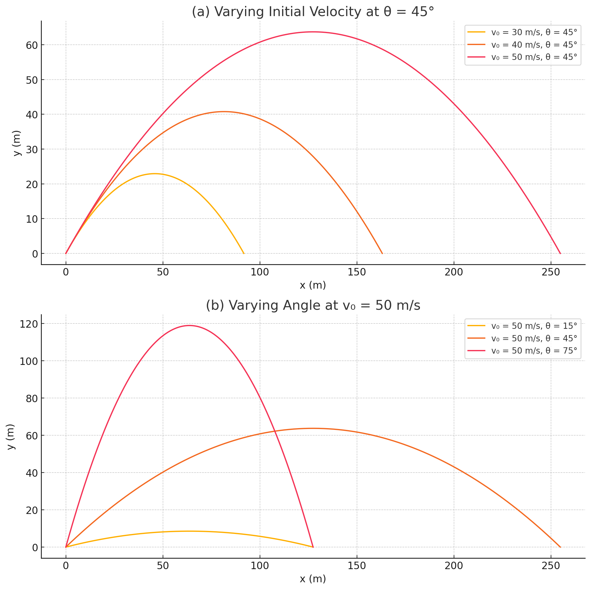

Problem 1
# Projectile Motion: A Detailed Theoretical and Computational Study

## 1. Theoretical Foundation

Projectile motion can be understood through Newtonian mechanics by analyzing the forces acting on a particle in two-dimensional space. Assuming no air resistance and a constant gravitational field, the motion can be described by the following set of differential equations:

$$
\begin{aligned}
\frac{d^2x}{dt^2} &= 0 \\
\frac{d^2y}{dt^2} &= -g
\end{aligned}
$$

where:
- \( x(t) \) and \( y(t) \) are the horizontal and vertical positions of the projectile as functions of time,
- \( g \) is the acceleration due to gravity.

Integrating these equations with respect to time yields the general solutions:

$$
\begin{aligned}
x(t) &= v_0 \cos(\theta) \cdot t \\
y(t) &= v_0 \sin(\theta) \cdot t - \frac{1}{2} g t^2
\end{aligned}
$$

Here:
- \( v_0 \) is the initial velocity,
- \( \theta \) is the angle of projection with respect to the horizontal.

The family of solutions arises from different values of initial conditions \( v_0 \), \( \theta \), and initial position. These variations determine the shape and range of each individual trajectory.

## 2. Analysis of the Range

The **range** \( R \) of a projectile is the horizontal distance it travels before returning to the same vertical level. Setting \( y(t) = 0 \) and solving for \( t \), we find the time of flight:

$$
t_{\text{flight}} = \frac{2 v_0 \sin(\theta)}{g}
$$

Substituting this into \( x(t) \), we get:

$$
R = \frac{v_0^2 \sin(2\theta)}{g}
$$

### Parameter Dependence:

- **Angle of Projection \( \theta \)**: The range is maximized when \( \theta = 45^\circ \), since \( \sin(2\theta) \) reaches its maximum value of 1 at this angle.
- **Initial Velocity \( v_0 \)**: Since the range is proportional to \( v_0^2 \), small changes in initial speed have a significant effect on the distance traveled.
- **Gravitational Acceleration \( g \)**: An increase in \( g \) results in a decrease in range, demonstrating an inverse relationship.

## 3. Practical Applications

The idealized model can be modified to accommodate real-world complexities, such as:

- **Uneven Terrain**: Altering the vertical motion equations to account for a sloped or varied ground surface.
- **Air Resistance**: Introducing a drag force proportional to velocity, which adds nonlinearity to the differential equations.
- **Variable Gravity**: Adjusting \( g \) in high-altitude or planetary simulations where gravity may change with height.

These extensions are crucial in fields such as:
- Ballistics and defense
- Sports physics (e.g., determining optimal angles in basketball or football)
- Space exploration (trajectory planning on other celestial bodies)

## 4. Implementation

To analyze and visualize projectile motion computationally, one can develop a simulation algorithm that:

1. Accepts initial conditions as input (e.g., \( v_0 \), \( \theta \), \( g \)),
2. Computes trajectory points using discrete time steps,
3. Determines the range and total flight time.

"""
This graph consists of two subplots illustrating the influence of initial speed and launch angle on projectile motion.

(a) In the first subplot, the launch angle is fixed at 45°, while the initial speed varies (30, 40, and 50 m/s). 
    The result shows that the horizontal range increases significantly with higher initial speeds.

(b) In the second subplot, the initial speed is fixed at 50 m/s, while the launch angle varies (15°, 45°, 75°).
    The maximum range is achieved at 45°, and angles symmetric around 45° (e.g., 15° and 75°) yield the same range,
    but with different trajectory shapes and heights.
"""
