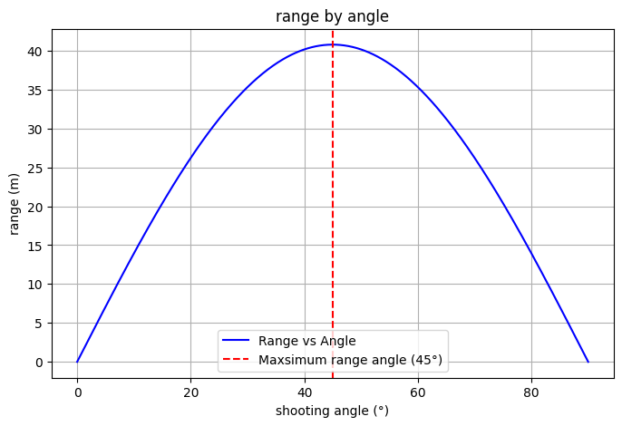

# Problem 1

# Investigating the Range as a Function of the Angle of Projection

## Theoretical Foundation

We begin by considering the motion of a projectile under the influence of gravity. The motion in both the horizontal and vertical directions can be described using the following equations:

### Equations of Motion

For a projectile launched with an initial velocity \( v_0 \) at an angle \( \theta \) to the horizontal, we can break the velocity into horizontal and vertical components:

- Horizontal velocity component: 
  $$ v_{0x} = v_0 \cos(\theta) $$

- Vertical velocity component: 
  $$ v_{0y} = v_0 \sin(\theta) $$

The equations of motion in the horizontal (\(x\)) and vertical (\(y\)) directions are given by:

1. Horizontal motion:
   $$ x(t) = v_{0x} t = v_0 \cos(\theta) t $$

2. Vertical motion:
   $$ y(t) = v_{0y} t - \frac{1}{2} g t^2 = v_0 \sin(\theta) t - \frac{1}{2} g t^2 $$

Where:
- \( g \) is the acceleration due to gravity
- \( t \) is the time of flight

### Time of Flight

To find the time of flight \( T \), we set the vertical displacement \( y(t) \) equal to zero when the projectile lands:

$$ 0 = v_0 \sin(\theta) T - \frac{1}{2} g T^2 $$

Solving for \( T \), we get:

$$ T = \frac{2 v_0 \sin(\theta)}{g} $$

### Range of the Projectile

The range \( R \) is the horizontal distance the projectile travels before landing. Using the time of flight \( T \), the range can be determined from the horizontal motion equation:

$$ R = x(T) = v_0 \cos(\theta) T $$

Substituting the expression for \( T \):

$$ R = v_0 \cos(\theta) \cdot \frac{2 v_0 \sin(\theta)}{g} $$

Simplifying the expression for the range:

$$ R = \frac{v_0^2 \sin(2\theta)}{g} $$

### Variations with Initial Conditions

As the angle \( \theta \) changes, the range of the projectile also changes. The sine function \( \sin(2\theta) \) shows how the range is maximized at an angle of \( 45^\circ \), where the value of \( \sin(2\theta) \) is 1.

Thus, the range is a function of the launch angle  $$ \theta $$ , initial velocity $$  v_0 $$ , and gravity \( g \). Variations in any of these initial conditions lead to a family of solutions for the range, allowing us to analyze how changes in conditions affect projectile motion.

## Analysis of the Range:

# Investigating the Range as a Function of the Angle of Projection

## Analysis of the Range

### Dependence of Range on the Angle of Projection

From the previous derivation, we know the range \( R \) of the projectile is given by the equation:

$$ R = \frac{v_0^2 \sin(2\theta)}{g} $$

Where:
- \( v_0 \) is the initial velocity
- \( \theta \) is the angle of projection
- \( g \) is the acceleration due to gravity

We can analyze the behavior of the range as a function of the angle of projection \( \theta \).

The term \( \sin(2\theta) \) in the range equation indicates that the range varies as a sinusoidal function of \( 2\theta \). The sine function reaches its maximum value of 1 when \( 2\theta = 90^\circ \), i.e., when \( \theta = 45^\circ \). Therefore, the maximum horizontal range is achieved when the angle of projection is \( 45^\circ \).

The relationship between the range and the angle of projection is symmetric. For angles greater than \( 45^\circ \), the range decreases as the sine function decreases after reaching its maximum. For angles less than \( 45^\circ \), the range also decreases as the angle moves further away from \( 45^\circ \).

Thus, the range is maximized when \( \theta = 45^\circ \), and for other angles, the range decreases symmetrically on either side of this optimal angle.

### Influence of Initial Velocity

The range \( R \) is directly proportional to the square of the initial velocity \( v_0 \):

$$ R \propto v_0^2 $$

This means that if the initial velocity \( v_0 \) is increased, the range of the projectile increases as well. For example, doubling the initial velocity would quadruple the range, assuming the angle of projection and gravitational acceleration remain constant.

### Influence of Gravitational Acceleration

The range \( R \) is inversely proportional to the acceleration due to gravity \( g \):

$$ R \propto \frac{1}{g} $$

This means that in regions with lower gravitational acceleration (e.g., on the Moon compared to Earth), the range of the projectile would be greater. If the gravitational acceleration \( g \) is decreased, the range increases, assuming all other factors remain constant.

### Combined Effect of Parameters

The horizontal range depends on the combined effects of the initial velocity, the angle of projection, and gravitational acceleration. The optimal angle for the maximum range is \( 45^\circ \), but the exact range achieved also depends on how large the initial velocity \( v_0 \) is and how small the gravitational acceleration $$ g $$ is. 

In summary:
- The range is maximized at $$ \theta = 45^\circ $$ .
- A higher initial velocity increases the range.
- A lower gravitational acceleration increases the range.

 

## Practical Applications

### Projectiles on Uneven Terrain

The model derived for projectile motion assumes a flat horizontal surface, where the projectile lands at the same height from which it was launched. However, in real-world scenarios, projectiles are often launched on uneven terrain, such as hilly or sloped surfaces. In these cases, the range calculation becomes more complex.

To adapt the model for uneven terrain, we need to account for the change in height between the launch point and the landing point. The range equation must be modified to include the initial and final vertical displacements. The general form of the equation in the presence of a slope (with angle \( \alpha \)) is:

$$ y(t) = v_0 \sin(\theta) t - \frac{1}{2} g t^2 $$

Where the final vertical displacement \( y(t) \) will equal the slope height \( h \), and we would solve for \( t \) and the corresponding range.

In this case, numerical methods or simulations are often employed to solve for the time of flight and range, as the equation becomes nonlinear due to the varying terrain height.

### Air Resistance

In reality, air resistance plays a significant role in the motion of projectiles, especially at high velocities. Air resistance acts against the motion of the projectile, slowing it down in both the horizontal and vertical directions. This introduces a non-conservative force, and the equations of motion must be modified accordingly.

The force due to air resistance is typically modeled as:

$$ F_{\text{drag}} = \frac{1}{2} C_d \rho A v^2 $$

Where:
- \( C_d \) is the drag coefficient (dependent on the shape of the object),
- \( \rho \) is the air density,
- \( A \) is the cross-sectional area of the projectile,
- \( v \) is the velocity of the projectile.

To account for air resistance, the motion equations must be solved using the following system of differential equations:

1. Horizontal direction: 
   $$ m \frac{d^2 x}{dt^2} = -\frac{1}{2} C_d \rho A v \frac{dx}{dt} $$

2. Vertical direction:
   $$ m \frac{d^2 y}{dt^2} = -mg - \frac{1}{2} C_d \rho A v \frac{dy}{dt} $$

Here, \( v = \sqrt{\left(\frac{dx}{dt}\right)^2 + \left(\frac{dy}{dt}\right)^2} \) represents the velocity magnitude.

Incorporating air resistance requires numerical methods, such as Euler's method or Runge-Kutta methods, to solve these coupled differential equations. This makes the problem significantly more complex but provides a more accurate model of projectile motion in the real world.

### Practical Considerations

- **Accuracy of the Model**: In practical applications, adjustments for air resistance and terrain are crucial to making accurate predictions. In engineering, for example, understanding these factors is essential for designing projectiles, missiles, or sports equipment.
- **Applications in Sports**: In sports such as basketball, soccer, or golf, understanding projectile motion with air resistance is crucial to predicting ball trajectories and optimizing performance.
- **Military and Aerospace Engineering**: The design of artillery, missiles, and space missions often requires accounting for air resistance and uneven terrain, especially when the projectiles travel at high speeds and long distances.