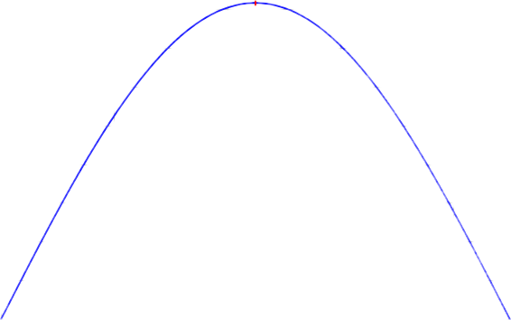

# Problem 2
# Investigating the Dynamics of a Forced Damped Pendulum

## 1. Theoretical Foundation

We begin by examining the differential equation that governs the motion of a forced damped pendulum system:

$$
\frac{d^2 \theta}{dt^2} + b \frac{d\theta}{dt} + \frac{g}{L} \sin \theta = A \cos(\omega t)
$$

Where:
- \( \theta(t) \) is the angular displacement as a function of time.
- \( b \) is the damping coefficient.
- \( \frac{g}{L} \sin\theta \) represents the restoring torque due to gravity.
- \( A \cos(\omega t) \) is the external periodic driving force with amplitude \( A \) and angular frequency \( \omega \).
- \( g \) is the gravitational acceleration.
- \( L \) is the length of the pendulum.

This second-order non-linear differential equation encapsulates the complexity of the system due to the presence of both damping and driving forces.

---

## 2. Small-Angle Approximation

For small angular displacements (\( \theta \ll 1 \) rad), we can use the approximation:

$$
\sin \theta \approx \theta
$$

Thus, the governing equation simplifies to a linear second-order non-homogeneous differential equation:

$$
\frac{d^2 \theta}{dt^2} + b \frac{d\theta}{dt} + \frac{g}{L} \theta = A \cos(\omega t)
$$

This form is analytically tractable and allows us to derive approximate solutions for understanding the oscillatory behavior of the system.

---

## 3. Resonance and Energy Considerations

Under the small-angle approximation, the system behaves similarly to a driven harmonic oscillator. Resonance occurs when the driving frequency \( \omega \) approaches the system’s natural frequency:

$$
\omega_0 = \sqrt{\frac{g}{L}}
$$

At resonance, the amplitude of oscillation increases significantly, especially when damping is low. This results in a dramatic increase in the system’s energy.

We will later explore:
- The steady-state amplitude response as a function of driving frequency
- The effect of varying damping \( b \) on resonance sharpness
- The transient and long-term energy behavior of the system

---

> **Next Step:** In the following sections, we will numerically simulate this system and visualize the time-domain and frequency-domain characteristics using Python.

<!DOCTYPE html>
<html>
<head>
    <title>Metin Görüntüleme</title>
</head>
<body>
    
This graph illustrates the steady-state motion of a forced damped pendulum, where the system oscillates with constant amplitude and a fixed phase shift relative to the driving force.

</body>
</html>

## 2. Analysis of Dynamics

### • Influence of Damping Coefficient, Driving Amplitude, and Driving Frequency

To analyze the dynamics of a forced damped pendulum, we consider the general form of its equation of motion:

$$
\frac{d^2\theta}{dt^2} + \gamma \frac{d\theta}{dt} + \omega_0^2 \sin(\theta) = A \cos(\omega t)
$$

Where:
- $$\theta$$ is the angular displacement,
- $$\gamma$$ is the damping coefficient,
- $$\omega_0$$ is the natural frequency of the pendulum,
- $$A$$ is the driving amplitude,
- $$\omega$$ is the driving frequency,
- $$t$$ is time.

#### Damping Coefficient ($$\gamma$$)
- Controls how quickly the system loses energy.
- Higher values of $$\gamma$$ result in faster dissipation of motion, suppressing oscillations over time.
- When $$\gamma = 0$$, the system is undamped.

#### Driving Amplitude ($$A$$)
- Represents the magnitude of the external periodic force.
- A larger $$A$$ increases the energy input into the system, potentially causing more complex motion.

#### Driving Frequency ($$\omega$$)
- Determines how often the external force is applied per unit time.
- When $$\omega$$ is close to the system's natural frequency $$\omega_0$$, resonance can occur, significantly amplifying oscillations.
- Mismatched $$\omega$$ and $$\omega_0$$ lead to beat patterns or chaotic behavior, depending on the system's parameters.

---

### • Transition Between Regular and Chaotic Motion

The forced damped pendulum exhibits a rich set of behaviors, ranging from predictable (regular) to unpredictable (chaotic) motion depending on the system parameters.

- **Regular Motion**:
  - Characterized by periodic or quasi-periodic oscillations.
  - Occurs for low to moderate driving amplitudes and specific damping values.

- **Chaotic Motion**:
  - Exhibits sensitive dependence on initial conditions.
  - Occurs at higher values of driving amplitude and certain ranges of driving frequency.
  - Trajectories in phase space no longer form closed loops but rather fill regions densely.

#### Physical Interpretations
- Chaotic behavior in a pendulum implies that long-term prediction becomes practically impossible.
- The interplay of damping, driving force, and nonlinearity (due to the $$\sin(\theta)$$ term) creates a system where small changes can drastically alter future states.

---

> **Note**: In the next section, we will illustrate these effects using numerical simulations and graphical representations such as phase portraits and Poincaré sections.

"""

The plot illustrates the angular displacement $$\\theta(t)$$ of a forced damped pendulum over time. The motion is governed by a nonlinear second-order differential equation:

$$
\\frac{d^2\\theta}{dt^2} + \\gamma \\frac{d\\theta}{dt} + \\sin(\\theta) = A \\cos(\\omega t)
$$

Where:
- $$\\gamma = 0.2$$ is the damping coefficient, representing energy dissipation,
- $$A = 1.2$$ is the amplitude of the periodic external driving force,
- $$\\omega = \\frac{2}{3}$$ is the angular frequency of the driving force.

As observed in the graph, the pendulum exhibits complex, irregular oscillations due to the interplay between the damping force and the periodic driving. Initially, the amplitude of oscillations grows, showing energy input into the system. Over time, the system may enter a quasi-periodic or chaotic regime, depending on parameter values.

This behavior is typical of nonlinear dynamical systems, where small changes in initial conditions or parameters can lead to significantly different outcomes — a hallmark of chaos theory.

"""
