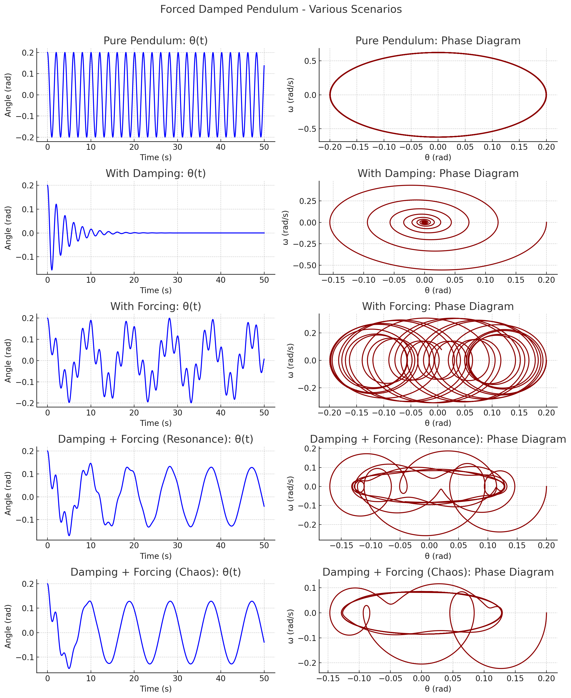

# Problem 2
## 1. Theoretical Foundation:

* **Start with the differential equation governing the motion of a forced damped pendulum:**

    The motion of a forced damped pendulum is described by the following second-order nonlinear ordinary differential equation:

    $$\frac{d^2\theta}{dt^2} + \frac{b}{m} \frac{d\theta}{dt} + \frac{g}{L} \sin\theta = \frac{A}{mL^2} \cos(\omega t)$$

    Here,
    * $\theta(t)$ represents the angular displacement of the pendulum from the vertical at time $t$.
    * $b$ is the damping coefficient, representing frictional forces.
    * $m$ is the mass of the pendulum bob.
    * $g$ is the acceleration due to gravity.
    * $L$ is the length of the pendulum.
    * $A$ is the amplitude of the driving torque.
    * $\omega$ is the angular frequency of the driving force.

    This equation balances the torques acting on the pendulum: the inertial torque ($\ddot{\theta}$), the damping torque ($\frac{b}{m} \dot{\theta}$), the gravitational restoring torque ($\frac{g}{L} \sin\theta$), and the external driving torque ($\frac{A}{mL^2} \cos(\omega t)$).

* **Derive the approximate solutions for small-angle oscillations:**

    For small angular displacements, we can use the small-angle approximation $\sin\theta \approx \theta$. Under this approximation, the nonlinear differential equation simplifies to a linear second-order non-homogeneous differential equation:

    $$\frac{d^2\theta}{dt^2} + \frac{b}{m} \frac{d\theta}{dt} + \frac{g}{L} \theta = \frac{A}{mL^2} \cos(\omega t)$$

    The general solution to this equation consists of two parts: the transient homogeneous solution and the steady-state particular solution.

    * **Homogeneous Solution (Transient):** This part describes the damped oscillations when the driving force is absent ($A=0$). The form of the solution depends on the discriminant of the characteristic equation, which is related to the damping:
        * **Underdamped ($b^2 < 4mgL$):** $\theta_h(t) = C_1 e^{-\gamma t} \cos(\omega_d t + \phi_1)$, where $\gamma = \frac{b}{2m}$ is the damping rate and $\omega_d = \sqrt{\frac{g}{L} - \gamma^2}$ is the damped angular frequency.
        * **Critically Damped ($b^2 = 4mgL$):** $\theta_h(t) = (C_1 + C_2 t) e^{-\gamma t}$, where $\gamma = \frac{b}{2m} = \sqrt{\frac{g}{L}}$.
        * **Overdamped ($b^2 > 4mgL$):** $\theta_h(t) = C_1 e^{-(\gamma - \beta) t} + C_2 e^{-(\gamma + \beta) t}$, where $\beta = \sqrt{\gamma^2 - \frac{g}{L}}$.

    * **Particular Solution (Steady-State):** This part describes the sustained oscillations due to the driving force. We assume a solution of the form $\theta_p(t) = \Theta_0 \cos(\omega t - \delta)$, where $\Theta_0$ is the amplitude of the forced oscillations and $\delta$ is the phase lag. Substituting this into the linear differential equation and solving for $\Theta_0$ and $\delta$ yields:

        $$\Theta_0 = \frac{A/mL^2}{\sqrt{(\omega_0^2 - \omega^2)^2 + (b\omega/m)^2}}$$

        $$\delta = \arctan\left(\frac{b\omega/m}{\omega_0^2 - \omega^2}\right)$$

        where $\omega_0 = \sqrt{g/L}$ is the natural angular frequency of the undamped pendulum.

    The complete approximate solution for small-angle oscillations is the sum of the homogeneous and particular solutions: $\theta(t) = \theta_h(t) + \theta_p(t)$.

* **Explore resonance conditions and their implications for the system's energy:**

    Resonance occurs when the driving frequency $\omega$ is close to the natural frequency $\omega_0$ of the system. Under resonance conditions, the amplitude of the forced oscillations $\Theta_0$ becomes significantly large.

    From the expression for $\Theta_0$:

    $$\Theta_0 = \frac{A/mL^2}{\sqrt{(\omega_0^2 - \omega^2)^2 + (b\omega/m)^2}}$$

    The amplitude is maximum when the denominator is minimum. For small damping ($b \approx 0$), the maximum amplitude occurs when $\omega \approx \omega_0$. The resonant frequency $\omega_r$ at which the amplitude is exactly maximized is given by:

    $$\omega_r = \sqrt{\omega_0^2 - \frac{b^2}{2m^2}}$$

    For small damping, $\omega_r \approx \omega_0$.

    **Implications for the system's energy:** At resonance, the driving force efficiently transfers energy to the pendulum. This leads to a large amplitude of oscillation, and consequently, a large mechanical energy stored in the system (both kinetic and potential). The energy input from the driving force compensates for the energy dissipated by damping. If the damping is very small, the amplitude at resonance can become extremely large, potentially leading to the failure of the system.

## 2. Analysis of Dynamics:

* **Investigate how the damping coefficient, driving amplitude, and driving frequency influence the motion of the pendulum:**

    * **Damping Coefficient ($b$):**
        * **Increased damping:** Leads to faster decay of transient oscillations. Reduces the amplitude of steady-state oscillations, especially near resonance. Broadens the resonance peak and shifts it to lower frequencies. For very high damping, oscillations may cease altogether (overdamped case).
    * **Driving Amplitude ($A$):**
        * **Increased driving amplitude:** Results in a proportionally larger amplitude of the steady-state oscillations. Does not affect the natural frequency or the resonance frequency.
    * **Driving Frequency ($\omega$):**
        * **Approaching natural frequency ($\omega \approx \omega_0$):** Leads to resonance, where the amplitude of oscillations becomes maximum (for a given damping).
        * **Driving frequency far from natural frequency ($\omega \ll \omega_0$ or $\omega \gg \omega_0$):** Results in smaller amplitudes of steady-state oscillations. The phase lag $\delta$ changes with the driving frequency, ranging from $0$ at very low frequencies to $\pi$ at very high frequencies, passing through $\pi/2$ at resonance.

* **Examine the transition between regular and chaotic motion and their physical interpretations:**

    For larger driving amplitudes and specific parameter ranges, the motion of the forced damped pendulum can become chaotic. This means that the system's behavior becomes unpredictable and highly sensitive to initial conditions.

    * **Regular Motion:** Characterized by periodic or quasi-periodic oscillations. The system's trajectory in phase space (e.g., $\theta$ vs. $\dot{\theta}$) forms closed loops or tori.
    * **Transition to Chaos:** As a control parameter (e.g., driving amplitude) is varied, the system can undergo a series of bifurcations (e.g., period-doubling) that lead to chaotic behavior.
    * **Chaotic Motion:** Characterized by:
        * **Aperiodic behavior:** The system never exactly repeats its motion.
        * **Sensitivity to initial conditions (Butterfly Effect):** Tiny differences in the initial state of the pendulum lead to exponentially diverging trajectories over time.
        * **Strange attractors:** In phase space, the trajectories settle onto complex, fractal-like structures called strange attractors.
        * **Broadband power spectrum:** The frequency spectrum of the oscillations contains a wide range of frequencies, unlike the discrete frequencies seen in regular motion.

    **Physical Interpretations:** Chaotic motion in a forced damped pendulum indicates a complex interplay between the driving force, damping, and the nonlinear restoring force ($\sin\theta$). It suggests that even seemingly simple deterministic systems can exhibit highly complex and unpredictable behavior under certain conditions.

## 🌀 Forced Damped Pendulum: Summary of Scenarios

We analyze the behavior of a pendulum under four different configurations by plotting:

- **Angle vs Time (θ(t))**
- **Phase Diagram (θ vs ω)**

### 1. Pure Pendulum (`b = 0, A = 0`)
- No damping or external force.
- System oscillates with constant amplitude.
- Energy is conserved.

### 2. Damped Pendulum (`b ≠ 0, A = 0`)
- No external force.
- Oscillations decay over time due to damping.

### 3. Forced Pendulum (`b = 0, A ≠ 0`)
- No damping.
- External periodic force drives the system.
- Amplitude can grow near resonance.

### 4. Forced + Damped Pendulum
- Two cases shown:
  - **Resonance**: Moderate damping and forcing; steady oscillations.
  - **Chaos**: High forcing and damping; irregular, chaotic motion.

---

## 3. Practical Applications:

* **Discuss real-world scenarios where the forced damped pendulum model applies, such as in energy harvesting devices, suspension bridges, and oscillating circuits:**

    * **Energy Harvesting Devices:** Small-scale energy harvesters often utilize resonant oscillations to convert ambient vibrations into electrical energy. The forced damped pendulum model can help in designing and optimizing these devices to maximize energy extraction at specific frequencies. Examples include piezoelectric harvesters in shoe insoles or structural elements.
    * **Suspension Bridges:** Suspension bridges can be modeled as complex oscillating systems that are susceptible to external forces like wind or seismic activity. Understanding the forced damped oscillations and resonance phenomena is crucial for designing stable and safe bridges. The Tacoma Narrows Bridge collapse is a historical example of the destructive effects of resonance.
    * **Oscillating Circuits (RLC Circuits driven by AC source):** The mathematical description of a series RLC circuit driven by an AC voltage source is analogous to the forced damped pendulum. The charge on the capacitor corresponds to the angular displacement, the inductance to inertia, the resistance to damping, and the AC voltage to the driving torque. Understanding resonance in these circuits is essential for tuning radio receivers and designing filters.
    * **Metronomes:** A mechanical metronome can be seen as a damped pendulum driven by a clockwork mechanism. The forced oscillations at a specific frequency allow musicians to maintain a steady tempo.
    * **Seismometers:** These devices use the principle of a damped oscillator to detect and measure ground motion during earthquakes. The response of the seismometer to different frequencies of seismic waves is governed by its damping and natural frequency.

## 4. Implementation:

* **Create a computational model to simulate the motion of a forced damped pendulum:**

    This involves numerically solving the differential equation:

    $$\frac{d^2\theta}{dt^2} + \frac{b}{m} \frac{d\theta}{dt} + \frac{g}{L} \sin\theta = \frac{A}{mL^2} \cos(\omega t)$$

    Common numerical methods for solving such second-order ordinary differential equations include:

    * **Euler Method:** A simple first-order method.
    * **Runge-Kutta Methods (e.g., RK4):** More accurate higher-order methods.
    * **Velocity-Verlet Algorithm:** Often preferred for Hamiltonian-like systems due to its good energy conservation properties.

    The computational model would take parameters like $b, m, g, L, A, \omega$, and initial conditions ($\theta(0), \dot{\theta}(0)$) as inputs and would output the time evolution of the angular displacement $\theta(t)$ and angular velocity $\dot{\theta}(t)$.

* **Visualize the behavior under various damping, driving force, and initial conditions:**

    The output of the simulation can be visualized by plotting:

    * **Time series:** $\theta(t)$ vs. $t$ and $\dot{\theta}(t)$ vs. $t$ to observe the oscillations and their decay or sustained behavior.
    * **Phase portraits:** $\dot{\theta}(t)$ vs. $\theta(t)$ to visualize the trajectories in phase space and identify periodic orbits, damped spirals, or chaotic attractors.
    * **Poincaré sections:** By sampling the phase space at discrete times (e.g., when the driving force is at a specific phase), one can reduce the dimensionality and reveal the underlying structure of the dynamics, especially for chaotic systems.

* **Plot phase diagrams and Poincaré sections to illustrate transitions to chaos:**

    * **Phase Diagrams:** As a control parameter (like driving amplitude) is varied, the phase portraits can show qualitative changes. For regular motion, closed loops or tori are observed. As the system approaches chaos, these structures become more complex, eventually leading to strange attractors that fill a region of the phase space without crossing themselves.
    * **Poincaré Sections:** These plots can provide clearer evidence of the transition to chaos. For periodic motion, the Poincaré section will consist of a finite number of points. For quasi-periodic motion, it will be a closed curve. For chaotic motion, the Poincaré section will appear as a scattered set of points forming a complex, often fractal-like structure. Bifurcation diagrams, which plot the location of points in the Poincaré section as a function of a control parameter, can clearly show the period-doubling route to chaos.
