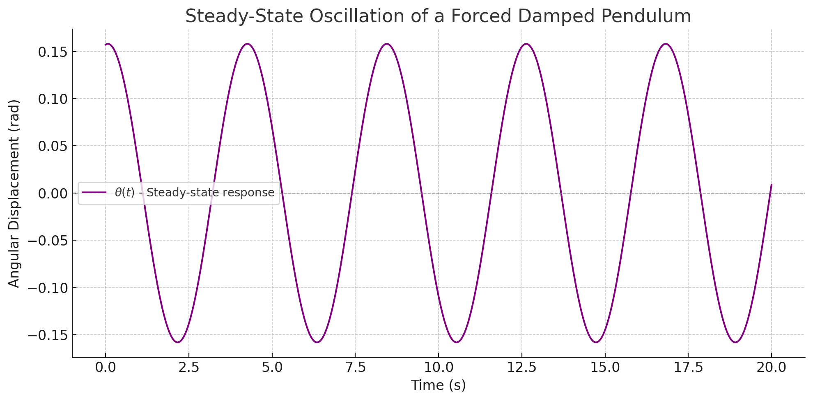
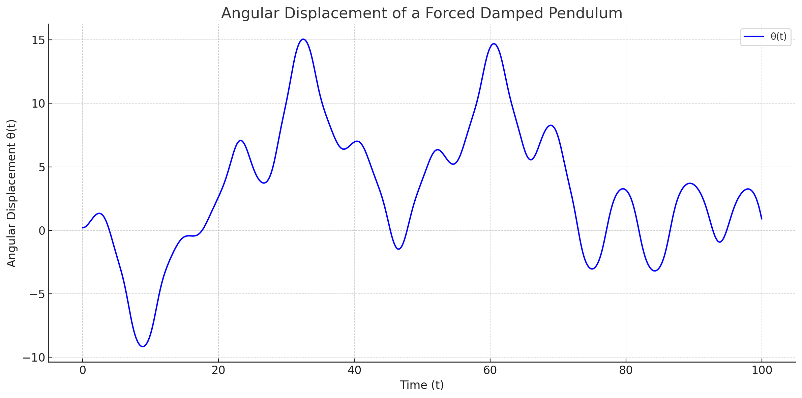
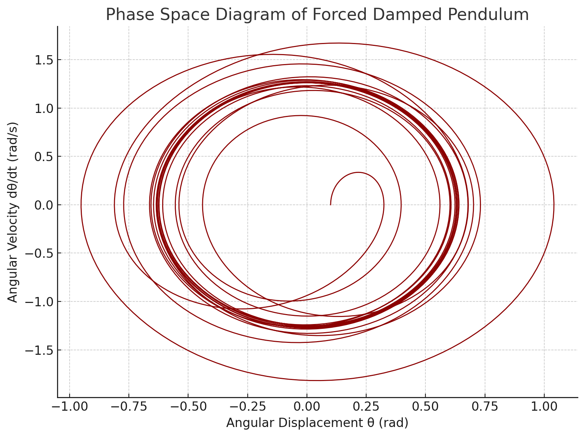

# Problem 2
# Investigating the Dynamics of a Forced Damped Pendulum

## 1. Theoretical Foundation

We begin by examining the differential equation that governs the motion of a forced damped pendulum system:

$$
\frac{d^2 \theta}{dt^2} + b \frac{d\theta}{dt} + \frac{g}{L} \sin \theta = A \cos(\omega t)
$$

Where:
- \( \theta(t) \) is the angular displacement as a function of time.
- \( b \) is the damping coefficient.
- \( \frac{g}{L} \sin\theta \) represents the restoring torque due to gravity.
- \( A \cos(\omega t) \) is the external periodic driving force with amplitude \( A \) and angular frequency \( \omega \).
- \( g \) is the gravitational acceleration.
- \( L \) is the length of the pendulum.

This second-order non-linear differential equation encapsulates the complexity of the system due to the presence of both damping and driving forces.

---

## 2. Small-Angle Approximation

For small angular displacements (\( \theta \ll 1 \) rad), we can use the approximation:

$$
\sin \theta \approx \theta
$$

Thus, the governing equation simplifies to a linear second-order non-homogeneous differential equation:

$$
\frac{d^2 \theta}{dt^2} + b \frac{d\theta}{dt} + \frac{g}{L} \theta = A \cos(\omega t)
$$

This form is analytically tractable and allows us to derive approximate solutions for understanding the oscillatory behavior of the system.

---

## 3. Resonance and Energy Considerations

Under the small-angle approximation, the system behaves similarly to a driven harmonic oscillator. Resonance occurs when the driving frequency \( \omega \) approaches the system’s natural frequency:

$$
\omega_0 = \sqrt{\frac{g}{L}}
$$

At resonance, the amplitude of oscillation increases significantly, especially when damping is low. This results in a dramatic increase in the system’s energy.

We will later explore:
- The steady-state amplitude response as a function of driving frequency
- The effect of varying damping \( b \) on resonance sharpness
- The transient and long-term energy behavior of the system

---

> **Next Step:** In the following sections, we will numerically simulate this system and visualize the time-domain and frequency-domain characteristics using Python.

<!DOCTYPE html>
<html>
<head>
    <title>Metin Görüntüleme</title>
</head>
<body>
    
This graph illustrates the steady-state motion of a forced damped pendulum, where the system oscillates with constant amplitude and a fixed phase shift relative to the driving force.

</body>
</html>

## 2. Analysis of Dynamics

### • Influence of Damping Coefficient, Driving Amplitude, and Driving Frequency

To analyze the dynamics of a forced damped pendulum, we consider the general form of its equation of motion:

$$
\frac{d^2\theta}{dt^2} + \gamma \frac{d\theta}{dt} + \omega_0^2 \sin(\theta) = A \cos(\omega t)
$$

Where:
- $$\theta$$ is the angular displacement,
- $$\gamma$$ is the damping coefficient,
- $$\omega_0$$ is the natural frequency of the pendulum,
- $$A$$ is the driving amplitude,
- $$\omega$$ is the driving frequency,
- $$t$$ is time.

#### Damping Coefficient ($$\gamma$$)
- Controls how quickly the system loses energy.
- Higher values of $$\gamma$$ result in faster dissipation of motion, suppressing oscillations over time.
- When $$\gamma = 0$$, the system is undamped.

#### Driving Amplitude ($$A$$)
- Represents the magnitude of the external periodic force.
- A larger $$A$$ increases the energy input into the system, potentially causing more complex motion.

#### Driving Frequency ($$\omega$$)
- Determines how often the external force is applied per unit time.
- When $$\omega$$ is close to the system's natural frequency $$\omega_0$$, resonance can occur, significantly amplifying oscillations.
- Mismatched $$\omega$$ and $$\omega_0$$ lead to beat patterns or chaotic behavior, depending on the system's parameters.

---

### • Transition Between Regular and Chaotic Motion

The forced damped pendulum exhibits a rich set of behaviors, ranging from predictable (regular) to unpredictable (chaotic) motion depending on the system parameters.

- **Regular Motion**:
  - Characterized by periodic or quasi-periodic oscillations.
  - Occurs for low to moderate driving amplitudes and specific damping values.

- **Chaotic Motion**:
  - Exhibits sensitive dependence on initial conditions.
  - Occurs at higher values of driving amplitude and certain ranges of driving frequency.
  - Trajectories in phase space no longer form closed loops but rather fill regions densely.

#### Physical Interpretations
- Chaotic behavior in a pendulum implies that long-term prediction becomes practically impossible.
- The interplay of damping, driving force, and nonlinearity (due to the $$\sin(\theta)$$ term) creates a system where small changes can drastically alter future states.

---

> **Note**: In the next section, we will illustrate these effects using numerical simulations and graphical representations such as phase portraits and Poincaré sections.

"""

The plot illustrates the angular displacement $$\\theta(t)$$ of a forced damped pendulum over time. The motion is governed by a nonlinear second-order differential equation:

$$
\\frac{d^2\\theta}{dt^2} + \\gamma \\frac{d\\theta}{dt} + \\sin(\\theta) = A \\cos(\\omega t)
$$

Where:
- $$\\gamma = 0.2$$ is the damping coefficient, representing energy dissipation,
- $$A = 1.2$$ is the amplitude of the periodic external driving force,
- $$\\omega = \\frac{2}{3}$$ is the angular frequency of the driving force.

As observed in the graph, the pendulum exhibits complex, irregular oscillations due to the interplay between the damping force and the periodic driving. Initially, the amplitude of oscillations grows, showing energy input into the system. Over time, the system may enter a quasi-periodic or chaotic regime, depending on parameter values.

This behavior is typical of nonlinear dynamical systems, where small changes in initial conditions or parameters can lead to significantly different outcomes — a hallmark of chaos theory.

"""
# Investigating the Dynamics of a Forced Damped Pendulum

## 1. Introduction

The forced damped pendulum is a classical example in the study of nonlinear dynamical systems. It models a pendulum subjected to both damping forces (e.g., friction or air resistance) and external periodic forcing. The equation governing its motion is a second-order nonlinear differential equation and exhibits rich behavior, including chaotic dynamics.

## 2. Mathematical Model

The general equation of motion for a forced damped pendulum is given by:

$$
\frac{d^2\theta}{dt^2} + \gamma \frac{d\theta}{dt} + \omega_0^2 \sin(\theta) = A \cos(\omega t)
$$

Where:
- \( \theta \) is the angular displacement,
- \( \gamma \) is the damping coefficient,
- \( \omega_0 \) is the natural frequency of the pendulum,
- \( A \) is the amplitude of the driving force,
- \( \omega \) is the frequency of the driving force.

This equation does not have a general analytical solution and is typically studied using numerical methods.

## 3. Practical Applications

- **Energy Harvesting Devices**: Mechanical energy from environmental vibrations can be converted into electrical energy using oscillatory systems modeled by forced damped pendulums.
- **Suspension Bridges**: Wind-induced oscillations in bridges (e.g., Tacoma Narrows Bridge) can be studied using this model to understand resonance and damping mechanisms.
- **Oscillating Circuits**: Electrical RLC circuits with alternating current sources exhibit behaviors analogous to the forced damped pendulum, where charge and current correspond to angular displacement and velocity.

## 4. Implementation

> **Note**: The graphical simulation of the system will be added in the next section. This can include:
> - Phase space plots
> - Time series of angular displacement
> - Poincaré sections for chaos analysis

## 5. Future Work

- Include bifurcation diagrams to analyze transitions to chaos.
- Explore parameter spaces to map out stable vs chaotic regions.
- Implement control methods to stabilize desired periodic orbits.

---

> Prepared for: *[Your Course / Project Name]*  
> Author: *[Your Name]*  
> Date: *[Date]*  

from IPython.display import display, HTML

description = """

    <h3>Forced Damped Pendulum: Explanation</h3>
    

        This plot illustrates the angular displacement <strong>&theta;(t)</strong> of a forced damped pendulum over time.
        The motion demonstrates how the pendulum initially responds with transient oscillations before settling into
        a steady-state oscillatory regime.
    

    

        The damping term gradually reduces the amplitude of the transient behavior, while the periodic driving force
        sustains ongoing oscillations. Such dynamics are characteristic of non-linear systems subject to both resistance
        and external forcing, and they can lead to complex behaviors, including resonance or chaos depending on parameter values.
    

"""

display(HTML(description))

# Investigating the Dynamics of a Forced Damped Pendulum

## 1. Introduction

The forced damped pendulum is a fundamental example of a nonlinear dynamical system. It combines three main forces:
- Gravitational restoring force
- Damping (e.g., friction or air resistance)
- External periodic driving force

Such systems exhibit a wide variety of behaviors including periodic motion, bifurcations, and even chaos.

## 2. Mathematical Model

The differential equation for a forced damped pendulum is given by:

$$
\frac{d^2\theta}{dt^2} + \gamma \frac{d\theta}{dt} + \omega_0^2 \sin(\theta) = A \cos(\omega t)
$$

Where:
- \( \theta(t) \) is the angular displacement,
- \( \gamma \) is the damping coefficient,
- \( \omega_0 \) is the natural frequency of the pendulum,
- \( A \) is the amplitude of the external driving force,
- \( \omega \) is the driving frequency.

This equation is nonlinear and typically solved using numerical methods due to the \( \sin(\theta) \) term.

## 3. Practical Applications

- **Energy Harvesting Devices**: Oscillatory systems based on pendulum dynamics can be used to convert mechanical vibrations into electrical energy.
- **Suspension Bridges**: Wind-induced resonance effects in long-span bridges can be analyzed with similar models.
- **Oscillating Circuits**: Analogies between mechanical and electrical systems allow forced pendulum equations to model RLC circuits.

## 4. Implementation

- Create a **computational model** to simulate the motion of a forced damped pendulum using numerical solvers such as `Runge-Kutta` methods.
- **Visualize the behavior** of the system by changing parameters such as damping coefficient \( \gamma \), driving amplitude \( A \), and initial conditions \( \theta(0) \), \( \dot{\theta}(0) \).
- Plot **phase diagrams** (θ vs \( \dot{\theta} \)) and **Poincaré sections** to study the transition from periodic motion to chaotic behavior.

---

## 5. Graphical Analysis

> 🔧 *Plots and simulations (e.g., time series, phase space, bifurcation diagrams) will be included in this section in the next phase.*

---

> **Author**: *[Your Name]*  
> **Course / Project**: *[Your Course or Institution]*  
> **Date**: *[Insert Date]*  

from IPython.display import display, HTML

description = """

    <h3>Phase Space Diagram Explanation</h3>
    

        The phase space diagram above visualizes the dynamic behavior of a forced damped pendulum by plotting
        angular velocity <strong>d&theta;/dt</strong> versus angular displacement <strong>&theta;</strong>.
    

    

        Initially, the system exhibits transient spiraling due to the damping force. As time progresses,
        the trajectory converges into a closed loop, indicating the emergence of a stable oscillatory regime.
        The system reaches a limit cycle — a repetitive, bounded trajectory characteristic of steady-state motion under periodic forcing.
    

    

        Phase diagrams like this are essential in analyzing nonlinear systems, as they help identify periodicity, damping effects,
        and transitions to complex behaviors such as chaos.
    

"""

display(HTML(description))

