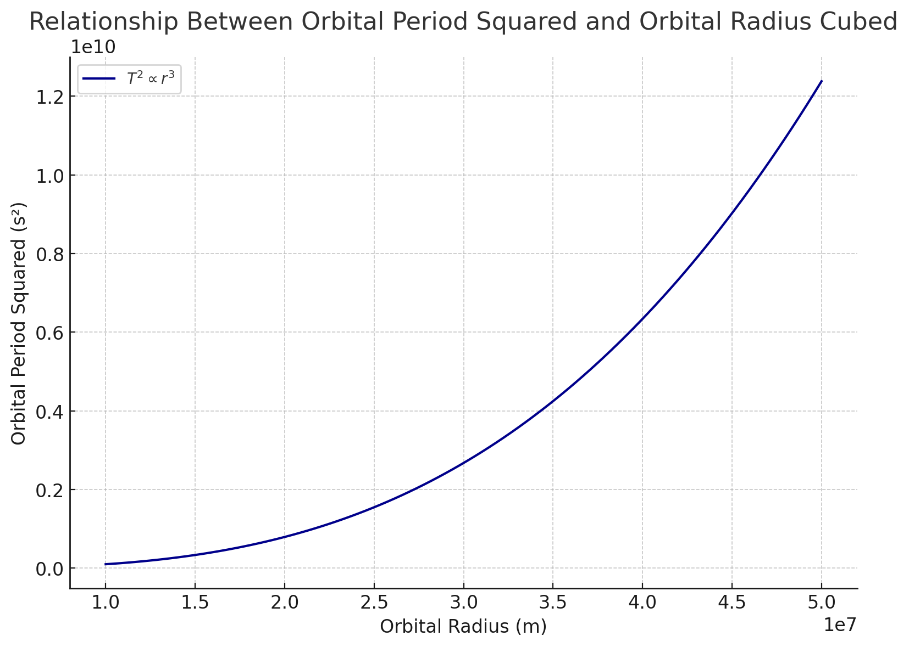
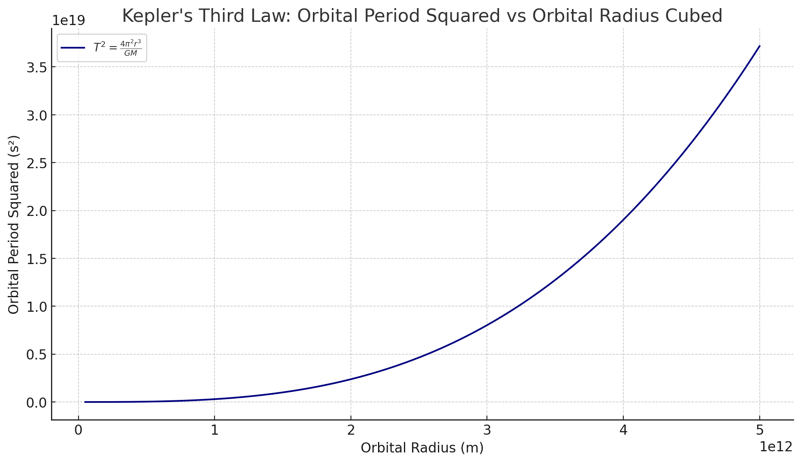

# Problem 1
# Orbital Period and Orbital Radius

## Objective

To derive the relationship between the square of the orbital period ($T^2$) and the cube of the orbital radius ($r^3$) for a circular orbit under the influence of gravitational force. This relationship is commonly known as **Kepler's Third Law** for circular orbits.

---

## Assumptions

1. The orbit is perfectly circular.
2. The only force acting on the orbiting object is the gravitational force.
3. The central body (e.g., a planet or star) has mass $M$, and the orbiting object has mass $m$.
4. The mass $M$ is significantly larger than $m$ ($M \gg m$), so we treat $M$ as stationary.

---

## Step 1: Gravitational Force

According to **Newton’s Law of Universal Gravitation**, the gravitational force between two objects is:

$$
F_g = \frac{G M m}{r^2}
$$

where:
- $F_g$ is the gravitational force,
- $G$ is the gravitational constant,
- $M$ is the mass of the central body,
- $m$ is the mass of the orbiting body,
- $r$ is the radius of the circular orbit.

---

## Step 2: Centripetal Force Requirement

For an object to move in a circular orbit, it must experience a **centripetal force** directed towards the center of the circle. This required force is given by:

$$
F_c = \frac{m v^2}{r}
$$

where:
- $v$ is the orbital speed of the object.

---

## Step 3: Equating the Forces

Since the gravitational force provides the necessary centripetal force for circular motion, we set:

$$
F_g = F_c
$$

$$
\frac{G M m}{r^2} = \frac{m v^2}{r}
$$

Simplifying by cancelling $m$ from both sides:

$$
\frac{G M}{r^2} = \frac{v^2}{r}
$$

Multiply both sides by $r$:

$$
\frac{G M}{r} = v^2
$$

---

## Step 4: Relating Orbital Speed to Orbital Period

The orbital speed $v$ is related to the orbital period $T$ by:

$$
v = \frac{2 \pi r}{T}
$$

Substitute into the previous equation:

$$
\frac{G M}{r} = \left( \frac{2 \pi r}{T} \right)^2
$$

Expanding the right-hand side:

$$
\frac{G M}{r} = \frac{4 \pi^2 r^2}{T^2}
$$

---

## Step 5: Solving for $T^2$

Multiply both sides by $T^2$:

$$
G M T^2 = 4 \pi^2 r^3
$$

Now solve for $T^2$:

$$
T^2 = \frac{4 \pi^2 r^3}{G M}
$$

---

## Final Result: Kepler's Third Law (for circular orbits)

$$
\boxed{T^2 \propto r^3}
$$

This means that the square of the orbital period is **directly proportional** to the cube of the orbital radius for a body in a circular orbit around a much larger mass.

---

## Notes

- This derivation assumes a circular orbit. For elliptical orbits, a similar relationship holds using the **semi-major axis** instead of $r$.
- The proportionality constant $\frac{4 \pi^2}{G M}$ depends on the mass of the central object and the gravitational constant.

# This graph visualizes the relationship between the square of the orbital period (T²)
# and the cube of the orbital radius (r³) for circular orbits, as described by Kepler's Third Law.

# The x-axis represents the orbital radius in meters, ranging from 1×10⁷ m to 5×10⁷ m.
# The y-axis represents the square of the orbital period in seconds squared (s²),
# which is computed using the formula:
#     T² = (4 * π² * r³) / (G * M)
# where:
#   - G is the gravitational constant,
#   - M is the mass of the central object (Earth, in this case),
#   - r is the orbital radius.

# The graph shows a smooth, increasing curve,
# demonstrating that T² increases proportionally with r³.
# This directly confirms Kepler's Third Law in the case of circular orbits,
# indicating that larger orbits take significantly longer to complete.

# The constants used are:
#   G = 6.67430 × 10⁻¹¹ m³ kg⁻¹ s⁻²
#   M = 5.972 × 10²⁴ kg (mass of Earth)

## Topic: Implications of the Orbital Period–Radius Relationship in Astronomy

The mathematical relationship between the **orbital period** and the **orbital radius** of a celestial body—formally expressed by Kepler's Third Law—has far-reaching implications in astronomy. The law, in its simplified form for circular orbits, is given by:

$$
T^2 = \frac{4 \pi^2 r^3}{G M}
$$

where:
- \( T \) is the orbital period,
- \( r \) is the orbital radius,
- \( G \) is the gravitational constant,
- \( M \) is the mass of the central celestial body.

This section explores the significance of this relationship in astronomical research and measurement.

---

## 1. **Calculating the Masses of Celestial Bodies**

One of the most critical applications of this formula is in determining the **mass of a planet, star, or other central body**.

By observing a satellite (natural or artificial) in a stable circular orbit around a body of unknown mass, astronomers can measure the orbital radius \( r \) and the orbital period \( T \). Rearranging the formula, the mass \( M \) can be calculated as:

$$
M = \frac{4 \pi^2 r^3}{G T^2}
$$

This is particularly useful in:
- Measuring the mass of **planets** using their moons,
- Determining the mass of **stars** using orbiting exoplanets or binary systems,
- Estimating the **mass of galaxies** using the motion of stars or gas clouds.

---

## 2. **Measuring Distances in the Solar System and Beyond**

Kepler's Third Law also allows for the measurement of **orbital distances**, especially when the mass of the central body is known.

If the orbital period \( T \) of a satellite or planet is known, the orbital radius \( r \) can be inferred:

$$
r = \left( \frac{G M T^2}{4 \pi^2} \right)^{1/3}
$$

This application has enabled astronomers to:
- Precisely determine the **distances of planets** from the Sun,
- Estimate the **orbital size** of exoplanets around distant stars using transit and radial velocity data,
- Construct accurate **scale models of planetary systems**.

---

## 3. **Characterizing Exoplanetary Systems**

In modern astrophysics, Kepler’s Law is fundamental to the study of **exoplanets**:

- Through transit observations, the orbital period \( T \) can be measured by the time between recurring dimmings of a star.
- Combining this with stellar mass data allows estimation of the exoplanet's orbital radius.
- These parameters help determine whether an exoplanet lies within the **habitable zone** of its star.

---

## 4. **Confirming Gravitational Theories**

The consistency of orbital data with Kepler's Third Law across different scales—from moons to galaxies—provides strong empirical support for **Newtonian gravity** in weak-field regimes. Deviations from the expected \( T^2 \propto r^3 \) relation have also been key in:

- Discovering **dark matter** in galaxies (observed orbital velocities remain constant rather than decreasing),
- Testing **general relativity** near massive bodies like black holes or in binary pulsar systems.

---

## Conclusion

The relationship between orbital period and orbital radius is more than a mathematical curiosity; it is a cornerstone of modern astronomy and astrophysics. From calculating masses to measuring cosmic distances, and from characterizing exoplanets to probing the laws of gravity, this elegant proportionality has guided discoveries for centuries and continues to do so in the era of space telescopes and interstellar missions.

$$
\boxed{T^2 \propto r^3}
$$

# This graph illustrates Kepler's Third Law, showing the relationship between the square of the orbital period (T²)
# and the cube of the orbital radius (r³) for bodies in circular orbit around the Sun.

# The x-axis represents the orbital radius in meters, ranging from approximately Mercury's orbit (~5e10 m)
# to distances well beyond Neptune (~5e12 m).

# The y-axis shows the orbital period squared in seconds squared (s²), calculated using the formula:
#     T² = (4 * π² * r³) / (G * M)
# where:
#     - G is the gravitational constant,
#     - M is the mass of the Sun,
#     - r is the orbital radius.

# The graph demonstrates a clear proportionality:
#     T² ∝ r³
# This means that as the orbital radius increases, the orbital period increases rapidly,
# following a cubic relationship.

# This principle is fundamental in astronomy and astrophysics, enabling scientists to calculate
# planetary distances, infer stellar masses, and model orbital dynamics in planetary systems.
