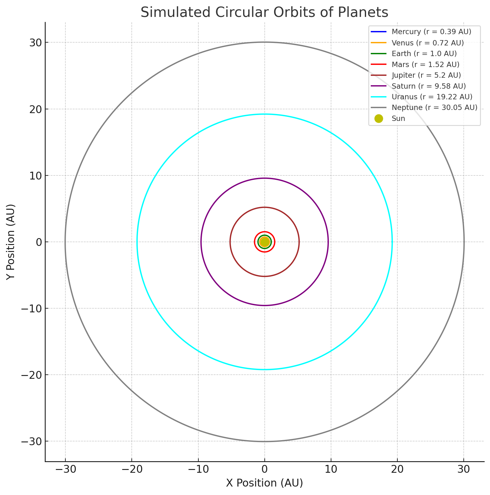
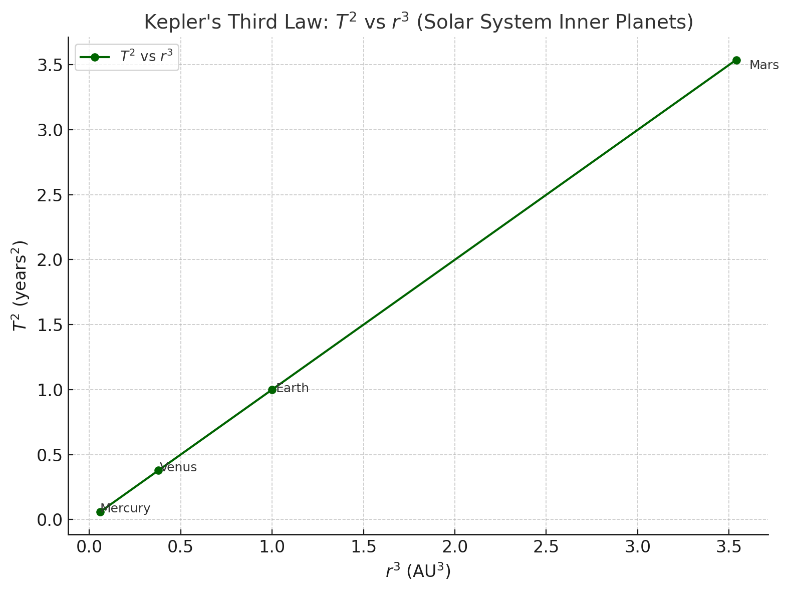

#Problem 1
## 1. Derivation of Kepler's Third Law ($T^2 \propto r^3$) for Circular Orbits:

Consider a planet of mass $m$ orbiting a star of mass $M$ in a circular orbit of radius $r$ with an orbital period $T$. For a stable orbit, the gravitational force providing the centripetal force required for circular motion.

The gravitational force ($F_g$) between the star and the planet is given by Newton's Law of Universal Gravitation:

$$F_g = G \frac{Mm}{r^2}$$

where $G$ is the universal gravitational constant.

The centripetal force ($F_c$) required to keep the planet in a circular orbit is given by:

$$F_c = m a_c = m \frac{v^2}{r}$$

where $v$ is the orbital speed of the planet.

For a stable circular orbit, the gravitational force must equal the centripetal force:

$$G \frac{Mm}{r^2} = m \frac{v^2}{r}$$

We can cancel the mass of the planet ($m$) from both sides:

$$G \frac{M}{r^2} = \frac{v^2}{r}$$

Now, we need to relate the orbital speed ($v$) to the orbital period ($T$). For one complete orbit, the planet travels a distance equal to the circumference of the circle ($2\pi r$) in time $T$. Therefore, the orbital speed is:

$$v = \frac{2\pi r}{T}$$

Substitute this expression for $v$ into the equation above:

$$G \frac{M}{r^2} = \frac{\left(\frac{2\pi r}{T}\right)^2}{r}$$

$$G \frac{M}{r^2} = \frac{4\pi^2 r^2}{T^2 r}$$

$$G \frac{M}{r^2} = \frac{4\pi^2 r}{T^2}$$

Now, rearrange the equation to find the relationship between $T^2$ and $r^3$:

$$T^2 = \frac{4\pi^2}{GM} r^3$$

This equation shows that the square of the orbital period ($T^2$) is directly proportional to the cube of the orbital radius ($r^3$) for circular orbits. The constant of proportionality is $\frac{4\pi^2}{GM}$, which depends only on the mass of the central body ($M$) and the universal gravitational constant ($G$).

## 2. Implications for Astronomy:

Kepler's Third Law has profound implications for astronomy:

* **Determining Planetary Masses:** If we know the orbital period ($T$) and the orbital radius ($r$) of a satellite (e.g., a moon) orbiting a planet, we can use Kepler's Third Law to determine the mass of the planet ($M_p$). Rearranging the formula:

    $$M_p = \frac{4\pi^2 r^3}{GT^2}$$

    This method has been crucial for estimating the masses of planets in our solar system and exoplanets orbiting distant stars.

* **Determining Stellar Masses:** Similarly, if we observe a planet orbiting a star and measure its orbital period and semi-major axis (which is approximately the radius for a nearly circular orbit), we can estimate the mass of the star ($M_s$):

    $$M_s = \frac{4\pi^2 a^3}{GT^2}$$

    where $a$ is the semi-major axis. This is a fundamental technique for studying the properties of stars.

* **Estimating Distances in Space:** While the law is derived assuming we know the orbital radius, in some cases, if we know the mass of the central body and can measure the orbital period of an orbiting object, we can estimate the orbital radius. This is particularly useful in understanding the scale of star systems and galaxies.

* **Understanding Orbital Dynamics:** Kepler's Third Law provides a fundamental relationship that governs the motion of celestial bodies under the influence of gravity. It helps astronomers understand the stability and characteristics of different orbital systems.

## 3. Real-World Examples:

* **The Moon's Orbit Around Earth:** The Moon orbits the Earth with a period of approximately 27.3 days ($T_{Moon}$) and an average orbital radius of about $3.84 \times 10^8$ meters ($r_{Moon}$). We can use these values and the known mass of the Earth to verify Kepler's Third Law for this system or, conversely, use the Moon's orbit to estimate the Earth's mass (as shown in section 4).

* **Orbits of Planets in the Solar System:** The planets in our solar system orbit the Sun in elliptical paths that are close to circular. Kepler's Third Law accurately describes the relationship between their orbital periods and their average distances (semi-major axes) from the Sun. Planets farther from the Sun have significantly longer orbital periods. For example, Mercury, being 
closest to the Sun, has a much shorter orbital period than Neptune, the farthest major planet.

## 4. Using Kepler's Third Law to Find Masses:

### 4.1. Mass of Earth using the Moon's Orbit:

We know the Moon's orbital period $T_{Moon} \approx 27.3 \text{ days} = 27.3 \times 24 \times 3600 \approx 2.36 \times 10^6 \text{ s}$ and its average orbital radius $r_{Moon} \approx 3.84 \times 10^8 \text{ m}$. Using Kepler's Third Law (rearranged for the central mass):

$$M_{Earth} = \frac{4\pi^2 r_{Moon}^3}{GT_{Moon}^2}$$

Plugging in the values ($G = 6.674 \times 10^{-11} \text{ N m}^2/\text{kg}^2$):

$$M_{Earth} = \frac{4\pi^2 (3.84 \times 10^8 \text{ m})^3}{(6.674 \times 10^{-11} \text{ N m}^2/\text{kg}^2)(2.36 \times 10^6 \text{ s})^2}$$

$$M_{Earth} \approx \frac{4\pi^2 (5.66 \times 10^{25})}{(6.674 \times 10^{-11})(5.57 \times 10^{12})}$$

$$M_{Earth} \approx \frac{2.24 \times 10^{27}}{3.71 \times 10^2}$$

$$M_{Earth} \approx 6.04 \times 10^{24} \text{ kg}$$

This value is very close to the accepted mass of the Earth ($5.972 \times 10^{24} \text{ kg}$).

### 4.2. Mass of the Sun using Earth's Orbit:

We know Earth's orbital period $T_{Earth} \approx 365.25 \text{ days} = 365.25 \times 24 \times 3600 \approx 3.156 \times 10^7 \text{ s}$ and its average orbital radius (semi-major axis) $a_{Earth} \approx 1.496 \times 10^{11} \text{ m}$ (1 Astronomical Unit). Using Kepler's Third Law:

$$M_{Sun} = \frac{4\pi^2 a_{Earth}^3}{GT_{Earth}^2}$$

Plugging in the values:

$$M_{Sun} = \frac{4\pi^2 (1.496 \times 10^{11} \text{ m})^3}{(6.674 \times 10^{-11} \text{ N m}^2/\text{kg}^2)(3.156 \times 10^7 \text{ s})^2}$$

$$M_{Sun} = \frac{4\pi^2 (3.348 \times 10^{33})}{(6.674 \times 10^{-11})(9.96 \times 10^{14})}$$

$$M_{Sun} \approx \frac{1.32 \times 10^{35}}{6.64 \times 10^4}$$

$$M_{Sun} \approx 1.99 \times 10^{30} \text{ kg}$$

This value is also very close to the accepted mass of the Sun ($1.989 \times 10^{30} \text{ kg}$).

These calculations demonstrate the power of Kepler's Third Law in determining the masses of celestial objects.
