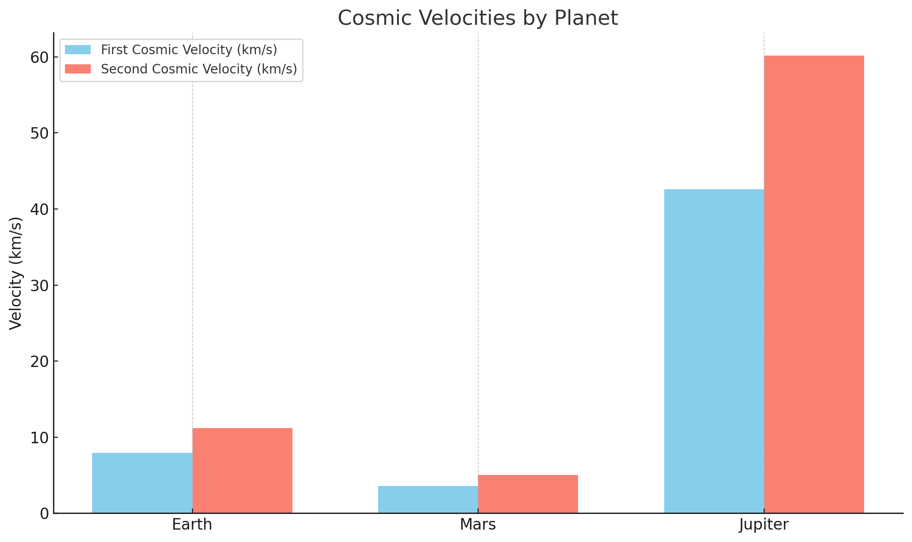

# Problem 2
# Escape Velocities and Cosmic Velocities

Understanding escape and cosmic velocities is essential in orbital mechanics and spaceflight dynamics. These velocities represent the minimum speeds required for different types of motion in a gravitational field.

---

##  What Are Cosmic Velocities?

Cosmic velocities are defined based on the gravitational influence of a planetary body, such as Earth. They are theoretical thresholds that determine different outcomes for an object launched from a planet's surface.

---

## 1️ First Cosmic Velocity (Orbital Velocity)

**Definition**:  
The first cosmic velocity is the minimum horizontal speed an object must have to enter a stable **circular orbit** close to the surface of a planet, without additional propulsion.

### Derivation:

To stay in orbit, the gravitational force must equal the centripetal force:

$$
\frac{mv^2}{r} = G \frac{Mm}{r^2}
$$

Solving for \( v \):

$$
v_1 = \sqrt{\frac{GM}{r}}
$$

Where:

- \( v_1 \) = first cosmic velocity (orbital velocity)
- \( G \) = gravitational constant (\(6.674 \times 10^{-11} \, \text{m}^3 \text{kg}^{-1} \text{s}^{-2}\))
- \( M \) = mass of the Earth (or central body)
- \( r \) = radius from the center of the Earth

### Physical Meaning:

- This velocity allows satellites to **orbit** the Earth in a circular trajectory.
- For Earth:  
  $$ v_1 \approx 7.9 \, \text{km/s} $$

---

## 2️ Second Cosmic Velocity (Escape Velocity)

**Definition**:  
The second cosmic velocity is the minimum speed an object must reach to **completely escape** a planet's gravitational field, assuming no further propulsion and neglecting air resistance.

### Derivation:

From conservation of energy:

$$
\frac{1}{2}mv^2 = G \frac{Mm}{r}
$$

Solving for \( v \):

$$
v_2 = \sqrt{\frac{2GM}{r}}
$$

### Relation to First Cosmic Velocity:

$$
v_2 = \sqrt{2} \cdot v_1
$$

### Physical Meaning:

- Reaching this speed means the object will **escape** Earth’s gravity and move into **interplanetary space**.
- For Earth:  
  $$ v_2 \approx 11.2 \, \text{km/s} $$

---

## 3️ Third Cosmic Velocity (Interstellar Escape Velocity)

**Definition**:  
The third cosmic velocity is the minimum speed required to **escape the Sun's gravitational field**, starting from Earth’s orbit.

This is the velocity needed to **leave the Solar System**.

### Derivation:

The object must escape both Earth’s gravity and the Sun’s gravity. The formula typically used assumes the object has already escaped Earth and is now influenced mainly by the Sun:

$$
v_3 = \sqrt{2GM_\odot \left( \frac{1}{r_\text{Earth}} \right)}
$$

Where:

- \( M_\odot \) = mass of the Sun
- \( r_\text{Earth} \) = distance from the Sun to Earth (\( \approx 1 \, \text{AU} \))

More accurately, you subtract the Earth's orbital velocity from the total velocity required:

$$
v_3 = \sqrt{2GM_\odot / r} - v_\text{Earth-orbit}
$$

### Physical Meaning:

- This is the speed needed to leave the **Solar System**, e.g., like Voyager 1.
- From Earth’s orbit:  
  $$ v_3 \approx 16.7 \, \text{km/s} $$

---

##  Parameter Analysis

Each cosmic velocity depends on key physical parameters:

| Velocity | Depends on | Formula | Implication |
|----------|------------|---------|-------------|
| \( v_1 \) | \( G, M, r \) | \( \sqrt{\frac{GM}{r}} \) | Increases with central mass, decreases with orbital radius |
| \( v_2 \) | \( G, M, r \) | \( \sqrt{\frac{2GM}{r}} \) | Similar dependencies, but requires more energy than \( v_1 \) |
| \( v_3 \) | \( G, M_\odot, r \) | \( \sqrt{\frac{2GM_\odot}{r}} - v_{\text{Earth}} \) | Adds solar parameters, combines planetary and heliocentric escape |

---

##  Summary

- **First cosmic velocity**: Orbit around a planet  
- **Second cosmic velocity**: Escape from planet  
- **Third cosmic velocity**: Escape from Solar System  
- All are derived from Newtonian gravity and energy conservation.
- The higher the gravitational pull or the closer you are to the mass center, the **greater** the required velocity.

---

*Next: We will visualize these velocities using comparative plots and explore real-world mission data (e.g., Apollo, Voyager, Parker Solar Probe).*

"""
First Cosmic Velocity (blue): decreases with altitude — the orbital speed needed for low Earth orbit
Second Cosmic Velocity (red): also decreases with altitude — the speed needed to escape Earth's gravity.
Third Cosmic Velocity (green dashed line): constant — the speed needed to escape the Solar System, starting from Earth's orbit.
"""

In spaceflight mechanics, **cosmic velocities** define the minimum speeds required for different orbital and escape scenarios. These values depend on the mass and radius of the celestial body in question. Understanding them is critical for launching satellites, sending missions to other planets, and exploring beyond the Solar System.

---

## 🚀 Overview of Cosmic Velocities

Cosmic velocities are classified into three main types:

1. **First Cosmic Velocity** – orbital velocity for a stable low orbit.
2. **Second Cosmic Velocity** – escape velocity to leave the planet's gravitational influence.
3. **Third Cosmic Velocity** – escape velocity to leave the Solar System from Earth's orbit.

---

## 🔢 Mathematical Definitions

### First Cosmic Velocity (Orbital Velocity)

This is the velocity required to achieve a **stable circular orbit** just above the surface of a planet:

$$
v_1 = \sqrt{\frac{GM}{r}}
$$

- \( G \): Gravitational constant \( (6.674 \times 10^{-11} \, \text{m}^3\,\text{kg}^{-1}\,\text{s}^{-2}) \)
- \( M \): Mass of the planet
- \( r \): Radius from the center of the planet

---

### Second Cosmic Velocity (Escape Velocity)

To escape a planet's gravitational pull entirely:

$$
v_2 = \sqrt{\frac{2GM}{r}}
$$

This is derived from energy conservation, where total mechanical energy equals zero.

---

### Third Cosmic Velocity (Interstellar Escape)

The velocity required to escape the **Sun's gravity** starting from Earth’s orbit:

$$
v_3 = \sqrt{\frac{2GM_{\odot}}{r_{\text{Earth}}}} - v_{\text{orbital}}
$$

- \( M_{\odot} \): Mass of the Sun  
- \( r_{\text{Earth}} \): Distance from the Sun to Earth (~1 AU)  
- \( v_{\text{orbital}} \): Earth's orbital velocity around the Sun

---

## 🌍 Comparative Values for Different Planets

### Constants and Planetary Data

| Planet  | Mass (\( M \)) [kg]         | Radius (\( r \)) [m]         |
|---------|-----------------------------|-------------------------------|
| Earth   | \( 5.972 \times 10^{24} \)  | \( 6.371 \times 10^6 \)       |
| Mars    | \( 6.417 \times 10^{23} \)  | \( 3.390 \times 10^6 \)       |
| Jupiter | \( 1.898 \times 10^{27} \)  | \( 6.991 \times 10^7 \)       |

Using the formulas above, we can compute the first and second cosmic velocities for each.

(Note: Third cosmic velocity is based on Sun's mass and Earth’s orbit, so it doesn’t vary by planet.)

---

## 📈 (To Be Visualized)

We will later visualize:

- The first and second cosmic velocities for Earth, Mars, and Jupiter.
- How these velocities change with altitude.
- Comparison of planetary surface escape speeds.

---

## 🛰 Importance in Space Exploration

Understanding these velocities is **fundamental** for mission planning:

### ✅ Launching Satellites

- Satellites require **first cosmic velocity** to stay in orbit.
- Different orbits (LEO, MEO, GEO) require slight variations.

### 🚀 Planetary Missions

- Missions to Mars, Moon, or outer planets must first achieve **second cosmic velocity**.
- After escaping Earth, they are inserted into **interplanetary transfer orbits**.

### 🌌 Interstellar Travel

- Missions like **Voyager 1** and **Voyager 2** required speeds near the **third cosmic velocity**.
- These missions leverage gravity assists to gain the extra velocity needed to escape the Sun’s influence.

---

## ✅ Summary

- **Cosmic velocities** are foundational for orbital mechanics and interplanetary mission design.
- They depend on planetary **mass** and **radius**, and are higher for more massive bodies.
- Mastery of these principles enables everything from **communication satellites** to **deep space probes**.

---

*Next: We will compute and visualize these velocities using real planetary data.*

"""
Here’s a comparison of the first and second cosmic velocities for Earth, Mars, and Jupiter. You can clearly see how much more energy is needed to escape the gravitational pull of a massive planet like Jupiter compared to Mars or Earth.
"""