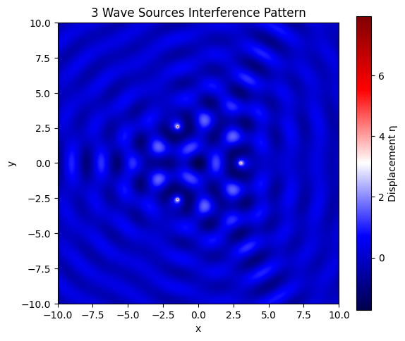

# Problem 1

# 🌊 Wave Interference Simulation on Water Surface

## 🎯 Task Overview

We are tasked with analyzing the **interference patterns** created by **circular water waves** emitted from **multiple coherent point sources**, which are positioned at the **vertices of a regular polygon**.

This involves studying **constructive and destructive interference** as the waves spread and interact over time and space.

---

## 📐 Mathematical Foundation

### 🔹 Single Point Source: Circular Wave Equation

The vertical displacement \( \eta(x, y, t) \) of the water surface at a point \( (x, y) \) and time \( t \), caused by a point source located at \( (x_0, y_0) \), is modeled by:

$$
\eta(x, y, t) = \frac{A}{\sqrt{r}} \cdot \cos(kr - \omega t + \phi)
$$

Where:

- \( A \): amplitude of the wave (how high the peaks are)
- \( r = \sqrt{(x - x_0)^2 + (y - y_0)^2} \): radial distance from the source
- \( k = \frac{2\pi}{\lambda} \): wave number, related to the wavelength \( \lambda \)
- \( \omega = 2\pi f \): angular frequency, related to the frequency \( f \)
- \( \phi \): initial phase
- \( \frac{1}{\sqrt{r}} \): accounts for 2D spreading — energy disperses in a circular pattern

This equation assumes **linear, non-dissipative**, and **isotropic wave propagation** — a typical approximation for surface ripples in water.

---

## 🧪 Problem Statement

We want to simulate and analyze the **interference patterns** created by the superposition of surface waves, each emitted from point sources arranged in a **regular polygon**.

We aim to:

- Identify regions of **constructive interference** (amplification)  
- Identify regions of **destructive interference** (cancellation)  
- Visualize how these patterns evolve over time

---

## 🧭 Step-by-Step Procedure with Physical Reasoning

### 1. **Select a Regular Polygon**

Choose a regular polygon (e.g., triangle, square, pentagon). This determines:

- The number of point sources \( N \)
- Their symmetric positions around a center
- The overall interference geometry (e.g., triangular symmetry)

### 2. **Position the Sources**

Place point sources at the **vertices** of the selected polygon.  
If the polygon is centered at the origin and has radius \( R \), then the position of the \( i \)-th vertex is:

$$
(x_i, y_i) = \left( R \cos\left( \frac{2\pi i}{N} \right), R \sin\left( \frac{2\pi i}{N} \right) \right), \quad i = 0, 1, ..., N-1
$$

This provides evenly spaced sources around a circle.

### 3. **Write the Wave Equation for Each Source**

For each source \( i \) located at \( (x_i, y_i) \), the wave it emits is:

$$
\eta_i(x, y, t) = \frac{A}{\sqrt{r_i}} \cdot \cos(k r_i - \omega t + \phi)
$$

where \( r_i = \sqrt{(x - x_i)^2 + (y - y_i)^2} \)

All sources emit **coherently**: they have the same frequency, wavelength, amplitude, and phase.

### 4. **Apply Superposition Principle**

At each point \( (x, y) \) on the surface, the total displacement is the sum of individual contributions:

$$
\eta_{\text{sum}}(x, y, t) = \sum_{i=1}^{N} \eta_i(x, y, t)
$$

This is the **core concept of wave interference**. The waves add up constructively or destructively depending on their phase relationship at each point.

---

## 🔬 Analyzing Interference Patterns

### Constructive Interference
Occurs when wave crests from different sources meet:
- Waves arrive **in-phase**
- Resulting amplitude increases
- Mathematically, phase difference \( \Delta \phi = 2n\pi \)

### Destructive Interference
Occurs when a crest meets a trough:
- Waves arrive **out-of-phase**
- Resulting amplitude decreases or cancels
- Phase difference \( \Delta \phi = (2n+1)\pi \)

These interference effects depend on:
- Source distances
- Wavelength
- Frequency
- Spatial arrangement

