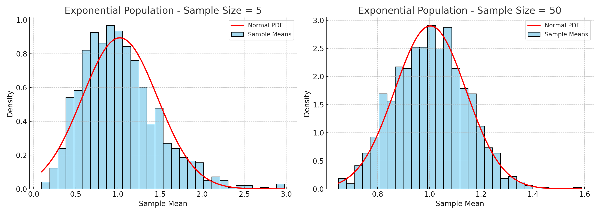
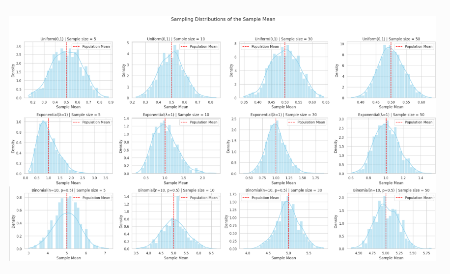
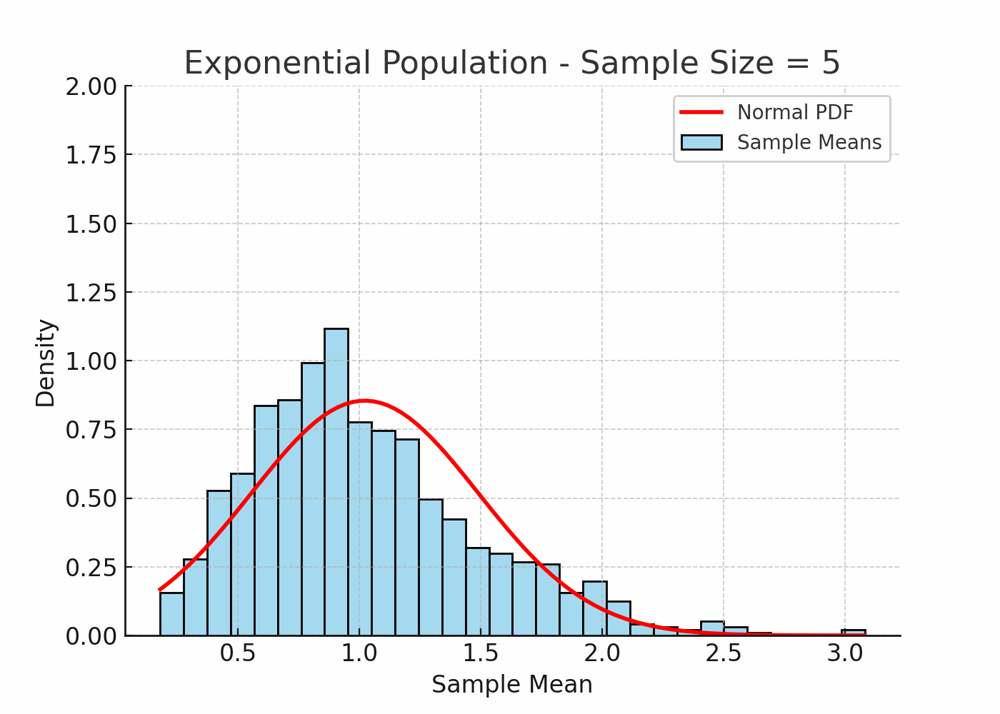

# Problem 1

# Central Limit Theorem (CLT) Demonstration Through Simulation
 
## Introduction
 
The **Central Limit Theorem (CLT)** is a core principle in probability and statistics. It states that regardless of the original distribution of a population, the distribution of the sample means will approximate a **normal distribution** as the sample size becomes large.
 
This result is the foundation of many statistical techniques and allows researchers and analysts to draw conclusions about populations using sample data, even when the population distribution is unknown or non-normal.
 
---
 
## Purpose of the Simulation
 
This simulation aims to:
 
- Model different population distributions
- Draw multiple random samples of varying sizes
- Observe the behavior of the **sample means**
- Visually and statistically confirm the Central Limit Theorem
 
---
 
## Simulation Framework
 
### Population Types
 
We generate synthetic populations of **100,000 data points** from each of the following distributions:
 
1. **Uniform Distribution [0, 1]** — continuous, bounded, and symmetric
2. **Exponential Distribution (λ = 1)** — continuous and right-skewed
3. **Binomial Distribution (n = 10, p = 0.5)** — discrete and roughly symmetric
 
These offer a diverse view of population shapes: flat, skewed, and discrete.
 
### Sampling Plan
 
For each population:
 
- Randomly draw **1000 samples** for each of the following sizes: **5, 10, 30, 50**
- Compute the **mean of each sample**
- Collect and store the resulting sample means
- Plot a histogram for each collection of sample means
- Overlay the **normal probability density function** using the observed mean and standard deviation
 
---
 
## Visualization Layout
 
The results will be organized in a 3x4 grid:
 
- **Rows**: Represent different population distributions
- **Columns**: Correspond to increasing sample sizes (5, 10, 30, 50)
 
Each cell displays a histogram of sample means for the corresponding setup, with a normal curve for comparison.
 
*(Insert visual grid here)*
 
---
 

## Results and Analysis
 
### Uniform Distribution [0, 1]
 
- **Sample size 5**: Slightly irregular, but already symmetric
- **Sample size 10**: Histogram becomes smoother
- **Sample size 30**: Approximates a normal distribution
- **Sample size 50**: Very close to normal; bell-shaped
 
### Exponential Distribution (λ = 1)
 
- **Sample size 5**: Skewed distribution of means
- **Sample size 10**: Skew reduces slightly
- **Sample size 30**: Nearly symmetric
- **Sample size 50**: Strong resemblance to a normal curve
 
### Binomial Distribution (n = 10, p = 0.5)
 
- **Sample size 5**: Roughly symmetric
- **Sample size 10**: Smoother, narrower peak
- **Sample size 30**: Clearly bell-shaped
- **Sample size 50**: Almost indistinguishable from normal
 
---
 
## Effect of Sample Size
 
| Sample Size | Behavior of Sampling Distribution        |
|-------------|-------------------------------------------|
| 5           | Often shows noticeable irregularities     |
| 10          | Becomes more stable and less skewed       |
| 30          | Resembles a normal distribution closely   |
| 50          | Strong convergence to normal shape        |
 
---
 
## Effect of Population Characteristics
 
| Distribution Type       | Skewness | Impact on CLT Convergence         | Variance Considerations               |
|-------------------------|----------|-----------------------------------|---------------------------------------|
| Uniform [0, 1]          | No       | Rapid convergence                 | Lower spread in means                 |
| Exponential (λ = 1)     | Yes      | Slower convergence due to skew    | High variability delays normal shape  |
| Binomial (n=10, p=0.5)  | No       | Quick convergence                 | Centered and compact around mean      |
 
---
 
## Conclusion
 
This simulation supports the Central Limit Theorem across a range of population shapes. As sample size increases, the distribution of the sample mean reliably trends toward normality—even when starting from skewed or discrete populations. The rate of this convergence depends on the shape and variance of the original population.
 
This insight helps justify the widespread use of normal-based methods in statistical inference, especially when dealing with large sample sizes.

