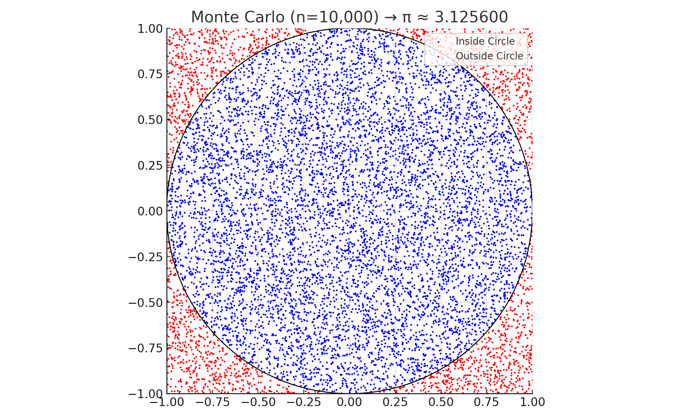
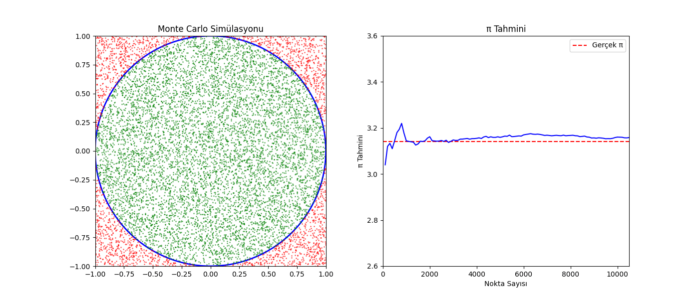

# Problem 2

# Estimating $\pi$ with Monte Carlo Simulation Techniques
 
## Overview
 
Monte Carlo methods rely on random sampling to approximate solutions to problems that may be deterministic in nature. One elegant use case is estimating the mathematical constant $\pi$ using random events and geometric relationships.
 
This experiment introduces two different approaches to estimate $\pi$:
 
- A **geometric simulation** involving random points inside a square and circle
- A **probabilistic simulation** inspired by **Buffon’s Needle problem**
 
Both methods allow us to explore randomness, convergence, and the power of simulation in numerical estimation.
 
---
 
## Method 1: Area-Based Estimation Using a Unit Circle
 
### Concept
 
Consider a square centered at the origin with side length 2. A circle of radius 1 is perfectly inscribed in the square.
 
- Area of the square = 4  
- Area of the circle = $\pi$  
- Therefore, the **probability** that a point randomly placed within the square also lies inside the circle is:  
  $\pi / 4$
 
Using this, we can estimate $\pi$ with the formula:
 
$ \pi \approx 4 \times \left( \frac{\text{Number of points inside the circle}}{\text{Total number of points}} \right) $
 
---
 
### Simulation Algorithm
 
1. Generate $n$ random coordinates in the square:  
   Each point has $x, y \in [-1, 1]$
2. For each point, determine whether it falls inside the circle:  
   Condition: $x^2 + y^2 \leq 1$
3. Count how many points satisfy this condition
4. Estimate $\pi$ using the derived proportion
 
---
 
### Visualization Plan
 
- Scatterplot showing random points
- Points **inside** the circle: colored one way (e.g., blue)
- Points **outside** the circle but inside the square: different color (e.g., red)
- Overlaid boundary of the circle for visual reference
 
---
 
### Observations
 
- Accuracy improves as the number of points increases
- Convergence follows the Law of Large Numbers:
  $ \text{Estimation error} \propto \frac{1}{\sqrt{n}} $
 
- While intuitive and simple, the convergence rate is relatively slow
 
---
 
## Method 2: Buffon’s Needle – A Probabilistic $\pi$ Estimation
 
### Concept
 
Buffon's Needle is a probability-based technique that involves dropping a needle of length $L$ on a floor with parallel lines spaced $d$ units apart. The chance that the needle crosses one of the lines is:
 
$ P = \frac{2L}{d\pi} $
 
By simulating this experiment and tracking how many times the needle crosses a line, we can approximate $\pi$ by solving for it:
 
$ \pi \approx \frac{2L \cdot n}{d \cdot h} $
 
Where:
 
- $n$ = total number of needle drops  
- $h$ = number of crosses  
- $L$ = needle length  
- $d$ = line spacing (must be $\geq L$)
 
---
 
### Simulation Algorithm
 
1. Choose constants:  
   - Needle length $L$  
   - Distance between lines $d$ (where $L \leq d$)
2. Repeat the following $n$ times:
   - Randomly select the center of the needle's vertical position
   - Randomly choose an angle $\theta$ between $0$ and $\pi$
   - Use geometry to determine whether the needle crosses a line:
     $ \text{Crosses if: } \frac{L}{2} \cdot \sin(\theta) \geq y_{\text{distance to nearest line}} $
 
3. Count the number of crossing events ($h$)
4. Estimate $\pi$ with the formula above
 
---
 
### Visualization Plan
 
- Plot several needles:
  - Red: those that cross a line
  - Blue: those that don’t
- Add horizontal grid lines to represent the line spacing
- Useful for visually validating crossing behavior
 
---
 
### Observations
 
- This method is sensitive to trigonometric calculations
- Requires large samples for reasonable accuracy
- Offers a deeper probabilistic interpretation of $\pi$
 
---
 
## Output Requirements
 
| Deliverable              | Description                                           |
|--------------------------|-------------------------------------------------------|
| Simulation Code          | Python/NumPy code to run both methods                 |
| Scatterplots             | For circle-based point generation                     |
| Needle Drop Visuals      | For Buffon’s simulation                               |
| $\pi$ vs Sample Size Plot| Tracks convergence and error for both methods         |
| Comparative Summary      | Highlights strengths, weaknesses, and convergence     |
 
---
 

## Summary Comparison
 
| Method           | Type               | Convergence Rate | Visualization Clarity | Conceptual Depth |
|------------------|--------------------|------------------|------------------------|------------------|
| Unit Circle       | Geometric Area     | Moderate         | Very High              | High             |
| Buffon’s Needle   | Probabilistic      | Slow             | Moderate               | Very High        |
 
---
 
## Best Practices for Simulation
 
- Always validate random sampling domains (e.g., angle between $0$ and $\pi$)
- Use sufficient trials (e.g., $\geq 10,\!000$) to see meaningful convergence
- Visualize results to confirm spatial or geometric logic
- Set random seed for reproducibility if needed
 
---
 
## Key Takeaways
 
These simulations reinforce several core ideas:
 
- Simulation can approximate even complex constants like $\pi$
- Randomness and geometry can be blended for insight
- The **Law of Large Numbers** governs convergence
- Monte Carlo methods provide practical, educational tools in statistics and numerical analysis
 
Both approaches offer distinct learning opportunities — one via area comparison and one through probabilistic crossing — showing that even a simple constant like $\pi$ connects deeply to randomness, geometry, and probability.

